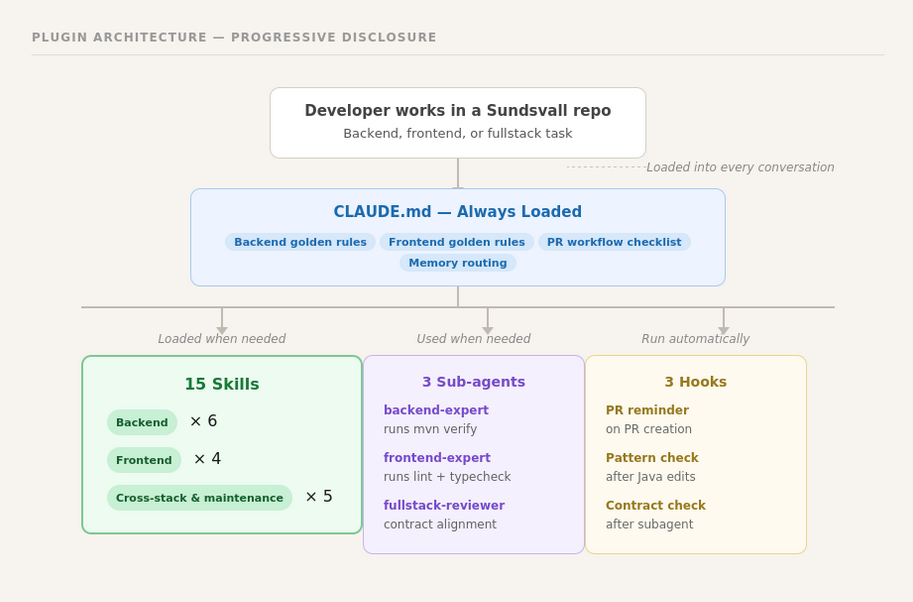
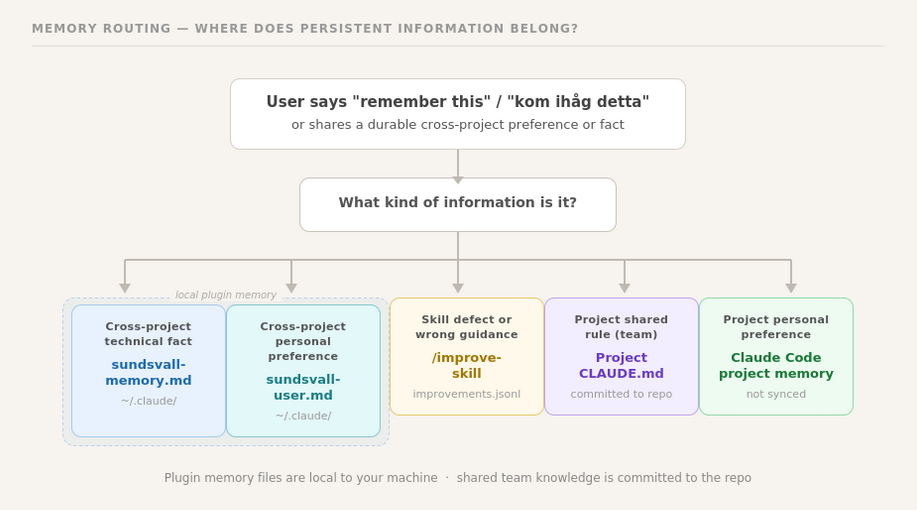

# Sundsvall Fullstack Plugin

Claude Code plugin marketplace for Sundsvallskommun fullstack development. It teaches Claude how Sundsvall projects work: dept44 Spring Boot microservices, Next.js + `@sk-web-gui` web apps, Jira/GitHub workflow, and the guardrails that keep changes aligned with team conventions.

## TL;DR

- **What it does:** teaches Claude the Sundsvall stack: dept44 backend patterns, `@sk-web-gui` usage, Sundsvall `web-app-*` frontend architecture, and Jira/GitHub workflow.
- **How it works:** small always-on rules in `CLAUDE.md`, deeper skills loaded on demand, and a few hooks for pattern checks and workflow reminders.
- **Memory:** stores small local cross-project facts and preferences in `~/.claude/sundsvall-memory.md` and `~/.claude/sundsvall-user.md`. Not shared, not synced, not committed.
- **Self-improvement:** lets developers log wrong skill guidance to `~/.claude/sundsvall-improvements.jsonl`, review it with `/sundsvall-fullstack:improve-skill`, and promote good fixes into the shared plugin.

## Quick Start

1. Add the marketplace and install the plugin.
2. Restart Claude Code if it was already running.
3. Open any Sundsvall repo and work normally.
4. Use slash commands when you want something specific:
   - `/sundsvall-fullstack:dept44-patterns`
   - `/sundsvall-fullstack:frontend-app`
   - `/sundsvall-fullstack:sk-web-gui`
   - `/sundsvall-fullstack:workflow`
5. Say `remember this` or `kom ihåg detta` if you want to save a cross-project preference.

## Installation

Add the marketplace once, then install the plugin:

```bash
# Add the marketplace (one-time)
/plugin marketplace add Sundsvallskommun/sundsvall-fullstack-plugin

# Install the fullstack plugin
/plugin install sundsvall-fullstack@sundsvall-fullstack-plugin
```

If Claude Code is already open, restart it after installation so the plugin, hooks, and MCP configuration reload cleanly.

### Atlassian integration (optional)

The plugin includes Jira/Confluence integration via MCP. The MCP server reads tokens from your shell environment when Claude Code starts, so the variables need to be set **before** launching Claude Code.

**One-time setup** — add to your shell profile so the tokens persist across sessions:

```bash
# Add these lines to ~/.zshrc (macOS) or ~/.bashrc (Linux)
export JIRA_PERSONAL_TOKEN="your-jira-token"
export CONFLUENCE_PERSONAL_TOKEN="your-confluence-token"
```

Then reload your shell (`source ~/.zshrc`) or open a new terminal. The tokens are now available every time you start Claude Code — you do not need to set them again.

> **Note:** The tokens are stored in plain text in your shell profile. If your organization requires more secure token storage, you can reference a secrets manager instead:
> ```bash
> export JIRA_PERSONAL_TOKEN="$(security find-generic-password -s jira-token -w)"  # macOS Keychain
> ```

Without these tokens, the Atlassian skills (`/sundsvall-fullstack:atlassian`, `/sundsvall-fullstack:workflow`) and MCP tools will not function. Everything else works without configuration.

## What's included

### Plugin: sundsvall-fullstack

A single consolidated plugin covering the full Sundsvall development stack.

#### Skills (15)

**Backend** (6 skills) — dept44 Spring Boot microservice patterns:

| Skill | What it does |
|---|---|
| `/sundsvall-fullstack:dept44-scaffold` | Scaffold new endpoints, entities, integrations, schedulers, and AppTests |
| `/sundsvall-fullstack:dept44-patterns` | Reference patterns for every layer — entity, resource, service, mapper, POJO, integration, scheduler, AppTest |
| `/sundsvall-fullstack:dept44-source` | Framework internals — AbstractAppTest API, Problem usage, Specification filters, pagination, file uploads |
| `/sundsvall-fullstack:dept44-migrate` | Migration guide from dept44 7.x to 8.0.x (Spring Boot 4, Jackson 3, WireMock 3) |
| `/sundsvall-fullstack:dept44-validators` | Built-in validators, custom validators, composite validators, and testing |
| `/sundsvall-fullstack:backend-security` | OAuth2 resource server, WSO2 gateway, service-to-service token flows |

**Frontend** (4 skills) — Next.js + @sk-web-gui web applications:

| Skill | What it does |
|---|---|
| `/sundsvall-fullstack:sk-web-gui` | Component reference for @sk-web-gui/react — components, props, compound patterns, GuiProvider, icons — works for any project using the library |
| `/sundsvall-fullstack:frontend-app` | Sundsvall web-app-* architecture — App Router, provider hierarchy, BFF pattern, Zustand state, i18n, Tailwind config |
| `/sundsvall-fullstack:frontend-design` | UI/UX guidelines — accessibility (WCAG AA), responsive design, component structure, code review checklist |
| `/sundsvall-fullstack:frontend-testing` | Jest + React Testing Library — component tests, mocking apiService/stores, testing i18n |

**Cross-stack** (3 skills) — workflow and integration:

| Skill | What it does |
|---|---|
| `/sundsvall-fullstack:fullstack-feature` | End-to-end feature implementation — backend-first ordering, BFF bridge, contract alignment, verification |
| `/sundsvall-fullstack:atlassian` | Jira/Confluence tool reference — JQL/CQL queries, issue lookup, documentation search |
| `/sundsvall-fullstack:workflow` | Jira+GitHub workflow — pick up ticket, create branch, PR with Jira linking, status transitions |

**Plugin maintenance** (2 skills):

| Skill | What it does |
|---|---|
| `/sundsvall-fullstack:improve-skill` | Review, classify, and promote accumulated skill improvement entries into concrete SKILL.md edits |
| `/sundsvall-fullstack:memory-manager` | Manage durable cross-project memory — ecosystem facts, workflow defaults, personal preferences |

#### Subagents (3)

Specialized agents that Claude dispatches automatically based on task context:

| Agent | Specialization |
|---|---|
| `backend-expert` | dept44 Spring Boot — enforces patterns, runs `mvn verify`, preloads backend skills |
| `frontend-expert` | Next.js + @sk-web-gui — enforces component usage, runs lint/typecheck, preloads frontend skills |
| `fullstack-reviewer` | Cross-stack review — verifies contract alignment, checks both stacks for pattern violations |

#### Hooks (3)

Automated checks that run without being asked:

| Hook | When it fires | What it does |
|---|---|---|
| PR workflow reminder | Creating a PR (Swedish/English) | Reminds to link Jira, add PR comment, transition status |
| Dept44 pattern check | After writing/editing Java files | Flags Lombok, @Autowired, wrong imports, missing @CircuitBreaker |
| Contract alignment | After any subagent completes | Reminds to verify field names, routes, and response types match across stacks |

#### Always-on rules (CLAUDE.md)

Loaded into every conversation automatically:

- Karpathy-inspired coding principles (read before writing, simplest solution, surgical changes, verify against goal)
- Frontend golden rules (@sk-web-gui first, compound pattern, GuiProvider, i18n)
- Backend golden rules (final everywhere, no Lombok, @CircuitBreaker, constructor injection, Problem.valueOf)
- Common mistakes to avoid for both stacks
- Jira PR workflow checklist
- Memory routing rules for `remember this` / `kom ihåg detta`, project rules, and skill improvements

## How it works

The plugin uses **progressive disclosure**:

1. `CLAUDE.md` is always loaded and keeps the essential rules small.
2. Skills load only when the current task needs them.
3. Hooks add a few automatic reminders and pattern checks.
4. Memory and self-improvement stay local until a developer chooses to promote something into the shared plugin.

This keeps context usage low while still giving Claude deep project knowledge when it matters.



Skills also include **behavioral routing** (`When NOT to Use` sections) so Claude can move to the correct skill when two areas overlap.

## Durable memory

The plugin can remember small, durable facts across Sundsvall projects in two local files under `~/.claude/`:

- `sundsvall-memory.md` — ecosystem-wide technical defaults such as dept44 version, workflow conventions, or active exceptions
- `sundsvall-user.md` — personal cross-project preferences such as communication style, code preferences, or review style

Both files are intentionally small and local to your machine. They are not committed to git, not shared with other developers, and not synced across machines.

Use `/sundsvall-fullstack:memory-manager` to review or manage them.

Routing model:
- `remember this` / `kom ihåg detta` → `/sundsvall-fullstack:memory-manager`
- skill defect → `/sundsvall-fullstack:improve-skill`
- project shared rule → project `CLAUDE.md`
- personal per-project preference → Claude Code project memory



## Self-improving skills

The plugin includes a lightweight learning loop inspired by [Hermes Agent](https://github.com/NousResearch/hermes-agent). When the agent notices a skill gave objectively wrong guidance, it can ask whether you want to log that issue for later review.

How it works:

1. During normal work, the agent detects wrong skill guidance and asks: "Log this for future improvement?"
2. If you agree, it appends a structured entry to `~/.claude/sundsvall-improvements.jsonl`
3. Entries accumulate across all your projects in that single file
4. When ready, run `/sundsvall-fullstack:improve-skill` from the plugin repo
5. The skill validates entries, deduplicates them, asks you to classify each one, and proposes concrete `SKILL.md` edits for real plugin bugs
6. Commit and push the approved fixes so the whole team benefits

The same skill also supports **manual intake**. If you notice an issue the agent missed, run `/sundsvall-fullstack:improve-skill` and log it directly. Manual intake works from any project; review/promote requires the plugin repo checkout.

All writes use safe local file operations, and shared improvement only happens when a developer chooses to promote and commit a fix.

## Adding more plugins

This repo is a **marketplace** — future plugins can be added alongside `sundsvall-fullstack`:

1. Create a new directory under `plugins/` with `.claude-plugin/plugin.json`
2. Add the plugin entry to `.claude-plugin/marketplace.json`
3. Users install it with `/plugin install new-plugin@sundsvall-fullstack-plugin`

## Tech stack covered

| Layer | Technology |
|---|---|
| **Backend framework** | dept44 (Spring Boot, JPA, Feign, Shedlock) |
| **Backend database** | MariaDB via Flyway migrations |
| **Backend testing** | JUnit 5, Mockito, WebTestClient, WireMock, Testcontainers |
| **Frontend framework** | Next.js 15 (App Router) |
| **Frontend UI** | @sk-web-gui/react (Sundsvallskommun design system) |
| **Frontend state** | Zustand |
| **Frontend i18n** | i18next + react-i18next |
| **Frontend styling** | Tailwind CSS with @sk-web-gui/core preset |
| **BFF** | Express + routing-controllers with OAuth2 token management |
| **API gateway** | WSO2 |
| **Issue tracking** | Jira (via mcp-atlassian) |
| **Documentation** | Confluence (via mcp-atlassian) |

## License

MIT
